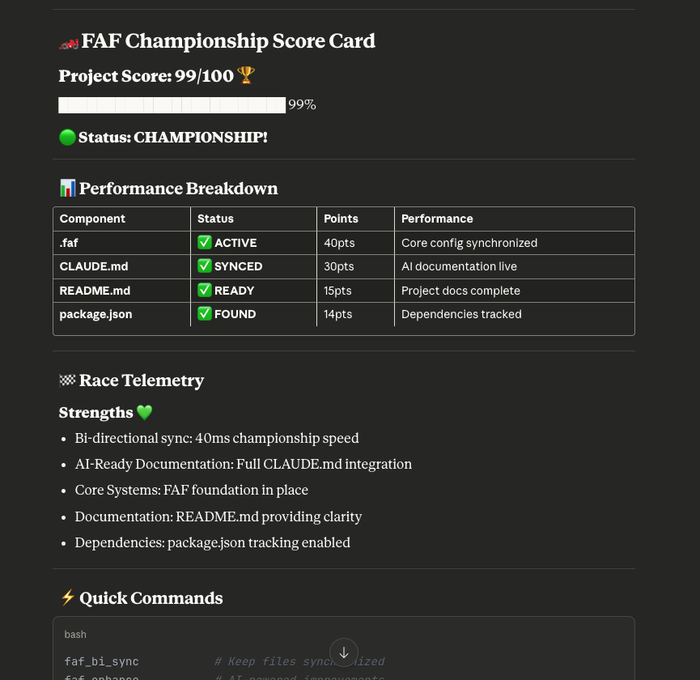

# claude-faf-mcp v2.5.3

<div align="center">


**Project DNA ✨ for ANY AI** • **33+ Tools** • **Championship Scoring**

</div>

<div align="center">

[](https://www.npmjs.com/package/claude-faf-mcp)
[](https://www.npmjs.com/package/claude-faf-mcp)
[](https://opensource.org/licenses/MIT)
[](https://www.typescriptlang.org/)

**[Website](https://faf.one)** • **[Community](https://github.com/Wolfe-Jam/faf/discussions)** • **[Issues](https://github.com/Wolfe-Jam/faf/issues)**

</div>

---

## 🏆 Championship Scoring System



Track your project's AI-readiness with F1-inspired tiers:

```
🏆 Trophy (100%)    - Championship - Perfect AI|HUMAN balance
🥇 Gold (99%)       - Gold standard
🥈 Silver (95-98%)  - Excellence
🥉 Bronze (85-94%)  - Production ready
🟢 Green (70-84%)   - Good foundation
🟡 Yellow (55-69%)  - Getting there
🔴 Red (0-54%)      - Needs attention
```

**Live output in Claude Desktop:**

```
🥉 Score: 88/100
█████████████████████░░░ 88%
Status: Bronze - Production Ready

Next milestone: 95% 🥈 Silver (7 points to go!)
```

---

## 🚀 Quick Start

```bash
# Install globally
npm install -g claude-faf-mcp

# Add to Claude Desktop config
# macOS/Linux: ~/Library/Application Support/Claude/claude_desktop_config.json
# Windows: %APPDATA%\Claude\claude_desktop_config.json

{
  "mcpServers": {
    "claude-faf-mcp": {
      "command": "claude-faf-mcp"
    }
  }
}
```

Restart Claude Desktop → Ready! 🏁

---

## 🎯 What is claude-faf-mcp?

MCP server that brings `.faf` format to Claude Desktop for instant project understanding.

**.faf = Project DNA for ANY AI ✨**
Universal, shareable context for Claude, ChatGPT, Gemini, or any AI - regardless of stack, size, or setup.

### Key Features

- ✅ **Zero Config** - Works out of the box
- ✅ **33+ Tools** - Complete project management
- ✅ **<11ms Speed** - Championship performance
- ✅ **Bi-Sync** - .faf ↔ CLAUDE.md synchronization
- ✅ **Type Safe** - 100% TypeScript strict mode
- ✅ **Production Ready** - 35/35 tests passing

---

## 🛠️ Available Tools

### Core Tools
- `faf_init` - Initialize project context
- `faf_auto` - Auto-detect and populate
- `faf_score` - Calculate AI readiness
- `faf_status` - Project health check

### Enhancement Tools
- `faf_enhance` - Optimize scoring
- `faf_sync` - Sync files
- `faf_bi_sync` - Bidirectional sync

### File Operations
- `faf_read` - Read files
- `faf_write` - Write files
- `faf_list` - List directories
- `faf_search` - Search content

[See all 33+ tools →](https://faf.one/docs/tools)

---

## 💡 Usage Example

1. **Drop any project file** into Claude Desktop
2. **Type**: "Run faf_auto to analyze this project"
3. **Get instant context** - Claude understands your codebase
4. **Use tools** - Access 33+ commands naturally in conversation

The `.faf` file persists across conversations - no need to re-explain your project!

---

## 📊 Technical Specs

```
Version:       2.5.3
Performance:   <11ms operations
TypeScript:    100% strict mode
Dependencies:  1 (MCP SDK only)
Tests:         35/35 passing
Build:         Zero errors
Coverage:      4,400+ lines
```

---

## 🎉 What's New in v2.5.3

**Championship branding complete** - Orange Smiley logo & score card now display on NPM (third time's the charm! 🏆)

### v2.5.2 - Visual Championship Experience

### Visual Championship Experience!
- **Orange Smiley branding** - Complete visual identity on NPM
- **Score card screenshot** - See the actual terminal output
- **Championship polish** - Professional presentation

### v2.5.1 - Documentation Polish
- **Championship README** - Trophy section leads for immediate impact
- **Optimized description** - Cleaner NPM presence
- **Professional structure** - Scannable, modern layout

### v2.5.0 - Championship Edition
- **7-tier medal system** for AI-readiness scoring
- **Visual progress bars** in terminal output
- **Milestone tracking** with next-level guidance
- **Enhanced scoring** for better project analysis

---

## 🏗️ Development

```bash
# Clone
git clone https://github.com/Wolfe-Jam/claude-faf-mcp.git
cd claude-faf-mcp

# Install & Build
npm install
npm run build

# Test
npm test

# Link locally
npm link
```

---

## 📋 Requirements

- **Node.js** 18+
- **Claude Desktop** (latest version)
- **OS**: macOS, Linux, or Windows

---

## 🔗 The FAF Ecosystem

- [🩵 **faf-cli**](https://npmjs.com/package/faf-cli) - Command line tool (v2.4.6)
- [🧡 **claude-faf-mcp**](https://npmjs.com/package/claude-faf-mcp) - This MCP server
- [💚 **faf.one**](https://faf.one) - Documentation & guides
- [🖥️ **Chrome Extension**](https://chromewebstore.google.com/detail/lnecebepmpjpilldfmndnaofbfjkjlkm) - Browser integration

---

## 📄 License

MIT License - See [LICENSE](./LICENSE) file

**Note**: The .faf-Engine is proprietary and available under separate license.

---

## 🤝 Contributing

We welcome contributions! Join our [community discussions](https://github.com/Wolfe-Jam/faf/discussions) or submit issues/PRs.

---

<div align="center">

**Made with 🧡 by wolfejam.dev**

**100% FREE Forever** • **Zero Dependencies** • **Zero Faff™**

[⭐ Star on GitHub](https://github.com/Wolfe-Jam/faf) • [📦 View on NPM](https://www.npmjs.com/package/claude-faf-mcp)

</div>
